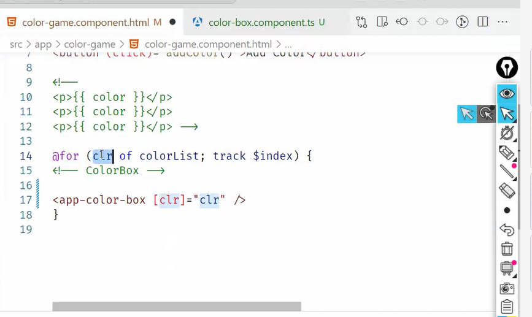
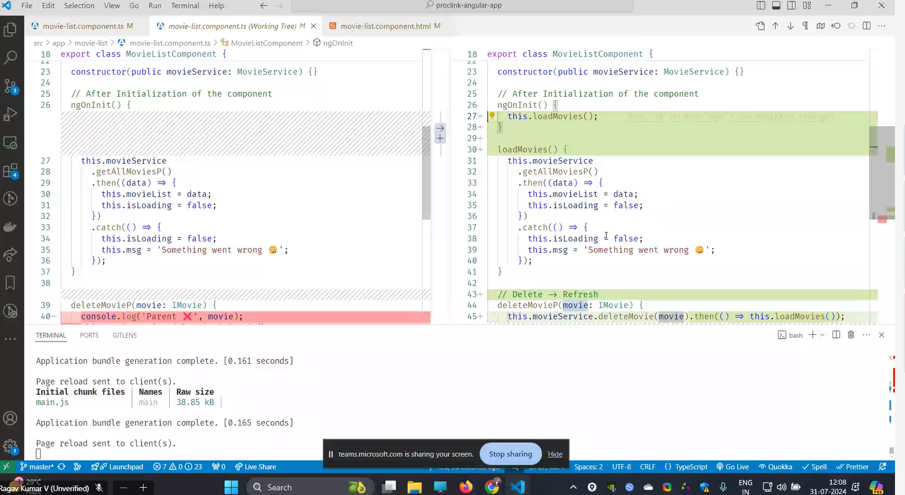
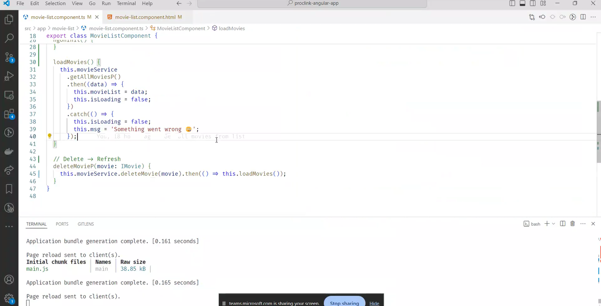

# angular

it was brought up by google

angular version 1:
its angular js.

angular version 2+:
is angular

angular 18 --is current version.

from 1 to 2 :
its completly new frame work., so it was difficult for developers to change, everthing.

api methods are same.
somany boost in features were added to increase the performance.

# state of web-Before Angular:

Google engineers, developed the framework known as AngularJS and officially released it in 2010.

popular in 2012.
Android was boom in 2012.
2012-->mobile net was cheaper.

before vs after:

call rate cutter
sms pack
internet pack
roaming charge

---


in google apps, angular is running behind the scenes.

example:google analytics., its uses angular.

we shuld never mix jquery with angular.

in yt analytics, some of them are running in angulr.

# effects:

1. drop in barrier to entry to the internet.
2. huge mboile traffic
3. huge business opportunity.

features:

1. making app more responsive should be easier.
2. app should not drain battery life.
3. app should load faster, even if network is not there.(up and down), app should be function.
   its called as resilient.

# web app:

user interaction, data affect the others experiences or their own experience.
they have the freedom to affect other ppl experiences or their experience.

# website:

the data will always be static.  
everybody will have same experience

## awwwards.com: new websites link.

---

angular

webpack+babe;-->transalotr/compiler

## htm+css+js

---

how did they achieve? all those features :

features:

# 1 . featur :Spa :

# SPA VS MPA

single page app vs multi page app.

1. in normal apps, each page is html file.

each html file, page will refresh everytime and load.

it will download again and again.

2. but in agular, there is only one html file.(index.html)

it will change the part which is highlighted.

through spa, part which is getting changed, only that we will load.

generally we will do it:
fetch the data,
dom methods to put on screen

angular will make this easier.


doing all these we get the smooth experience.

advantages of spa:
there is no refresh.
smooth performance
data saving-better caching(battery is not uses)
we are not loading, can be done in low network also.


fluid is spa.

# sequential experience

equal load time., its always will be slow. , initial load is slowe

# fluid experience

in fluid, the html part in js is higher,

initial load takes sokme time, its loading all the html pages.

way/solution:
we can split the code, and that alone we can load.

others which are not needed , can be loaded later.

this is called-->lazy loading/code splitting.

loading the background.

2. # feature: resuability:
   
   reusing the components.
   by declaring one time.

pattern:
view+logic--having in one container an re use it. 'this is called as component.

they copied from react.

view==>css+html
logic===>js

---

# process for creating angular projects

npm install -g @angular/cli(this should be downloaded in cmd).
then create a folder.
ng --version
ng new my-first-project
cd my-first-project
ng serve


ng run serve---to run the project.\

ng genric component component_name.(this is called scaffolding)

B2B companies use angular.

# structural director.

: ng if, ng for.(conditinally render)

(on condition they will load.)

# how angular is working behind the scenes.

view page source will give the data, files before loading js
in inspect it will give after loading the js .

<no script> tag is used, when there is no java script or js is off., whatever which is inside the no script, will be printed./displayed.

why js is offed?

wen broswer was weak, they swictched off the js.

the things which we write in htm file, will convert into .js behind the scenes in angular.

if js is not there, entire app will shutdown.

- angular will track the elements , to improve the performance
  like updating the particular elements.
  if no track is there, everything will get re render.
  it will be speed,only particular will rerender.

  ***

# process for using @for


in app component.ts, we need to add template @for and call the components from user.ts.

in html, we will call the selector of user.
and @for to show it on screen

# types of binding:


we can keep html file inside for loop,
,
but calling selector<app/.user > is having higher code quality.

the two main advantages are:

1. maintainability
2. reusability.

3. Property Binding:

   name is property of user,
   name is the property we are binding it to user.name
   so we are writing as

   ```js
   [name] = "user.name";
   ```


instead of giving somany inputs we can give like the above picture

if we want to pass down the data we use @input.
so this is called as drilling down the data.  
 in react it is called, data drilling.

why we are doing this?


we do all this to keep all the data in app component.

why are we dng this?
this is called pattern:
smart and presentation component.
here movies is the presenatation component.  
movielist is the smart component.

smart component will work with db.(fetching)
and presentation will display.

why?
we can reuse the movie component n number of times.

# like button:


model to sync---->view.
angular is doing automatically syncing,
update the model, view will also get updated.

<button (click)---this is event binding

3. two way binding:

its a combination of event and property binding.


if i change the model, view gets changed.

this is called banana in the box.

---this we have done smart and presentation.


  
clr is the property value of clr.

should learn ng if, ng for.

# two way binding:

we import formsmodule, to support ngmodel.

if we chnage the view, color is the model.
color gets updated, view is out of sync.

view gots updated, model got updates, since model updated, view get updates.
starts with view, and ends with view.

for example if we are writing color in text box, (view), model gets updated, and in view color will be displayed.

--this is giving typescript

  


 2. github 3. congigure the netflify 4. 5. 5. 5.  6. depploy

@if, will remove from the dom.
display none will not remove from the dom.


native apps-->android user.
web apps are more better than native apps.

why routing?

when no routing:

1. hit refresh u are lost.

2. cannot bookmark.

when we have routing:

1. organised.
2. ease of acess
3. shareing url.
4. secure route(i should show some things, only if they are logged in.)

current problem:  
it has only one html file.

routing in old web apps:more waiting.

solution:

- smooth routing.

mapping:


2.place holder, what to display.


with href(change the url), the load the page, it will load.
with router link: sam as href, but no refresh.  
<router-outlet>
is for display

# redirect:

wen lost to page,
then:


wheen we need redirection:


how to re-direct:

path film full means excatly it need to match.

deleting movie:


  


from child to parent-->its @output

from parent to child --->its @input
either input or output we will keep in child component only , instead of keepin in app(or parent) component.


dng opp of it.


# process of @output

  


this @output is used for deleting the particular movie.
movielist-->parent
movie is the child.

in movie we should write @output.
//delete movie:


final:


# angular material


is from google.
its

# add button


for dislike


# add-movie


# singleton

there is a problem,
after routing, /movies means, movielist component. '/add means addmovie component.

these both are siblings.
they are not parent and child,
so other concept is introduced, called "service",
it can share data amoung many components.

it is called as "singleton".
it means , create one obj, of this class., and share it with everyone.
it canbe used in multiple components.
its like global variable.

keep the global data.

# how to create a syntax for service.


only one object is created for particular class.


add imports


  


# styling:


<mat-card shoulf be there>
angular material: 
its for learning how to use 3rd class party apps.

# create new component.


adding parameter from router:
  


receipe app:

5. title of dish
6. image
7. ingredients
8. time to complete
9. procedure.(steps to cook)
10. category
    difficulty level(easy, medium, hard)

dashboard page,(search functionality by name, veg or non veg)
receipe details
should add receipe, delete receipe also

# node modules:

for windows package manager is chocolatey.  
in mac its brew install (chrome)  
in linux its apt is the pcakge manageer.

in angular its npm(node package manager.)

where it is from?  
npmsjs.com(website)(we can download)

  
 gitignore:
wht ever are there in git ignore, the github will not track it.  
 why?
they can install npm install,
node modules is 250mb.  
 2. .vs code files.

3. dist

how it will know which version to include?

in package.json all the versions are present, so it will know what to install.

# dependencies and dev depenedices in package.json:

only during development we require is dev depenedices.
they are nothing related to app.
(it )is coming from jasmine-core.

why it is there?  
its for developer experience.

these will not break the app, if somthing is broke in that files in devdepened.

for suppose, if something is missing from devdependency, still it will work.

dependencies, if one is not installed, then app will not work.

anyhow both are stored in node modules only.

karma: is for testing.

node_modules: contains more than 10k files.

each folder consists of sub folders.(each package json will require other 10 package json's)

ctrl+shift+v (reload) if vscode is struck.

mlm(multi level marketing): its similar to dependencies, which are requried to install 1st.(its depth first search, find the leaf node, install the down one, and corresponding to that, before., after installing all then the app will run)

yarn will install all properly, wen npm is not working,
pnpm is used, even wen yarn is notr working.  
 there yarn, pnpm all thhese are for npm install.

#in github: we can create fork, which is copy., make chnages and give pull request.

scaffolding means --generating the file.

# read me:

prcoess of how to do project ,set up the project.  
ng build will run netflify app.

npm run build==>ng serve.(shortcut)

# gzip:

to compress any type of folder.

for people it will have (estimated transfer size)

and wen opned in browser(it will give raw_size)

ngx,

brotli(better than gzip)(compression 30% fast)
app can run faster in brotli

# dist:

consists of only one index.html in browser.

-- (is called as css variable)

point of having the code in one line is, decreasing the size.

# what cli is doing behind the scenes:

1.  making into one line.(remove the spaces)  
    why?
    file size is smaller, it will compress(this is called as minifying)

2.  making varibales names to a,b, c(uglify js will do this.)

why deploying only, 7 files are required, that are present in dist files.

3. converting ts to js(this is called as transpiling-->converting one lang to other)

4. adding polyfill

inside dist folder, it consists of polyfills:  
A polyfill in JavaScript is a script that adds modern features to older browsers that do not natively support them.  
it will ad new features to browser

support older browsers

it will have promise code,

these all taken care through babble(supporting older browsers).

polyfill size is:

how cli is able to do, through webpack(it uses plugin system)

https://webpack.js.org/

# ts config.json:

while converting ts into js, which version should it convert(target:).

.spec.ts--> ts will know that these are test case files,

# editorconfig:

indent and all will presemt:

# angular.json:

third party is added into here automatcially,

we are setting a budget for building the app:
the files should be particular size only,, other wise, it will not build the app.

why?  
 so that our size should be smaller.

# main.ts:

it says which component it shuld start with,

its return type in promise object..

why?
so app will take, some time to bootstrap, thats why its promise object

bootsrapping application means ,creating dom elements , once html file is loaded.

# app config:

consist routing,router files, linking to main ts

# main-H7ON7QZ.JS (main-H7ON7QZ.JS why it is named as H7ON7QZ but not why as main .js in angular explain the code h70n7qz)

1. Purpose of File Names

- Cache Busting: The alphanumeric string (e.g., H7ON7QZ) is a hash or a unique identifier. This is used for cache busting, which helps ensure that browsers always load the most recent version of a file. When you deploy a new version of your application, the hash in the filename changes, prompting browsers to fetch the new file rather than using a cached version.

- File Versioning: By incorporating a hash in the filename, Angular can automatically manage file versions and ensure that users receive updated assets without the need for manual cache clearing.

# clear explanation:

starting,  
all the files will loads from server,  
it will lod from cache(memory)  
avd:  
load time decrreased,  
problem:  
caching works by file name.  
if same name is there for both versions, then cant update the versions.  
solution: name is the only prblm evertuime i build, the hash name gets changed.  
if we dont change the source code, then hashn name will be same. so that it can get update.

index.html will ask the new version of the file.

begin,  
challenge  
solution

# browser will not load from cache it loads from server ewhen a new version is searched.

# Ahead-of-time (AOT) compilation

before angular 5, aot can be on and off.

the Angular ahead-of-time (AOT) compiler converts your Angular HTML and TypeScript code into efficient JavaScript code during the build phase before the browser downloads and runs that code.

Compiling your application during the build process provides a faster rendering in the browser.

# tree shaking

Tree shaking, also called dead code elimination, is a process during which unused code is removed from our build. This technique allows us to reduce the final size of our application.

1. Begin:

- managing unused code is crucial beforee tree shaking

2. challenge :

- Your project has a lot of code and libraries.
- Some of this code is never used or needed in your final application.
- This extra code makes your app bigger and slower to load.

3. solution:

- Tree Shaking examines your project and identifies which parts of the code are actually being used.
- It then removes all the unused or unnecessary code from your final bundle.
- This results in a smaller and more efficient application that loads faster.


  


! not null assertion:

using mock api:


data is the angular model to display

after sonstrcutor call, template will execute.

in constructor if heavy api is there, then there would be loading, rendering, it will slow down the view.
solution:

render template 1st, then api.

sol is angular life cycle.(these are time machine)

ng oninit(){
after initialising the component
}
not to slow down the view


1st movelist is empty, it will render,then trigger the api and display those on screen

this is not the correct way


deleting using method:





# add :

genric: creating a type.


constructor call we need to give(inject router)

advance routing:


# navigation:


# REACTIVE FORMS:

in add movie--> import reactiveform module.  
in place of ngmodel keep->form controlname
inside formgrups we will have form contril names.
(ngsubmit)
it will not refresh the browser

error flow:
move away from feild

on blur
handleblur
touched=true


# edit


setvalue:

patchvalue:

partial update. update the part which is mentioned

setvalue:
it will make others null and give only the mentioned values.

lifecycle method is :
ngonit()

regex-one website to practise regular expressions.

(add,edit,delete,get)--->using crud operations

for and id,  
value and label.(imp)

ngif,ngfor, custom directives,custome pipes,rxjs

# lazy loaded:

t0 decrease the load on strting page,  
we will load the particular page,separetly wen clicking on

in route page we use,

when we do property binding, we dont need any interpolation.

to connect model to view and view to model,(we use 2 way binding)

attribute directives:

ng style:(dynamically we want to change we use it) (import ngstyle)
ng class

how it will know css is different for diff component?
it will create custom classes,attrubute selector[] will have id,,

# node js

what is nodejs?

eniviormnemnt torun js.(place to run js)

why node.js?
some thing broswers cannot do?
crud operations it cannot do.  
it is intentiionally made that way.  
so that others canit change them.

dis advantages :

browers are restricted.

1, cannot acess file systerm  
2.cannot acess hardware details  
3.cannot copy files.  
4. cannot delete files. '

Famous virus are spread through browser.
!. love viruse:
early 20000's 2. worm virus:
it will duplicate

node js is to used to run js, build web apps.

# node js usage:

1. streaming:
2. BDA
3. CHAT BOT
4. web srcapping(stealing data )

# rxjs:

use case:
we are reacting to what user use is typing.
its converting into api:
its compatibility to wrok with any of the framework.  
how it works:
everyting is a stream.
website:rxjs marble.:helps for understanding stream.
data is comin over the time
its like time set interval.

# pub and submodel:

stream which is coming us called observable data,

publisher--->sends the data to particular platform
submodel:will recive notification,from publisher, if we want data, we need to subscribe to it.


observable: untill u subscribe we will not get.\

# obervable:

. Observables provide support for passing messages between parts of your application.


whenever we go to nest request, cancel the prebious request,

we cant do it in promises.
in observable its very easy.


# types of operations

# creatio: interval is used for creating

# filtering

# transformation

# combination(combing two oberservable---.merge)

# creation:

without any operator we can


until u subscribe, we will not get data.
to complete subscripto--->
subscription.complete()

  
https://stackblitz.com/edit/rxjs-zhsmte?file=index.ts

with "of" we can create observable:


take(2)---> 2 things ony it will give.

1. creation
2. transformation
3. subscription.

# filtering operators :

# debounce:

there are looking for clamness of time, if there is no time in between , it will print the last one.

# distinct until changed:

when the value is chnaged only it will be printed..
removing the duplicate part

# skip:

opp of take4
skip(2)
it will give last 2 elements

last:
last will give only last

# combination operators:

# concat:

merges .

# combineLatest:


# switchMap:

subcribing to new one(interval)

how its usefuel:
wever searching the data, and cancel the previous request so it useful by using switch map.

cancellation can be don with switch map.  
important

unsubrivbe previous interval amd start new

stackblitz:online testing , creating the app.

for auto complete to work in serach functionality use
(input) instead of change
