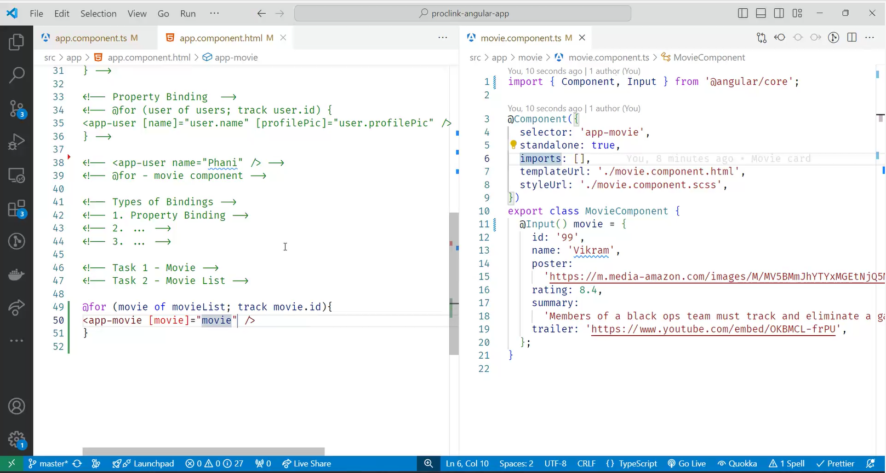
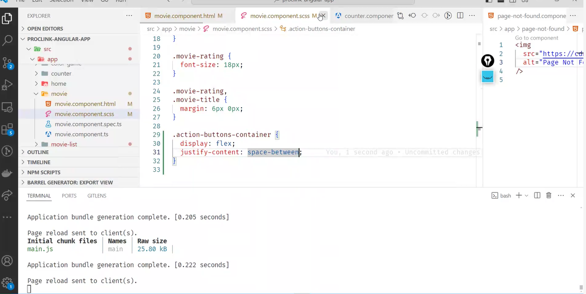
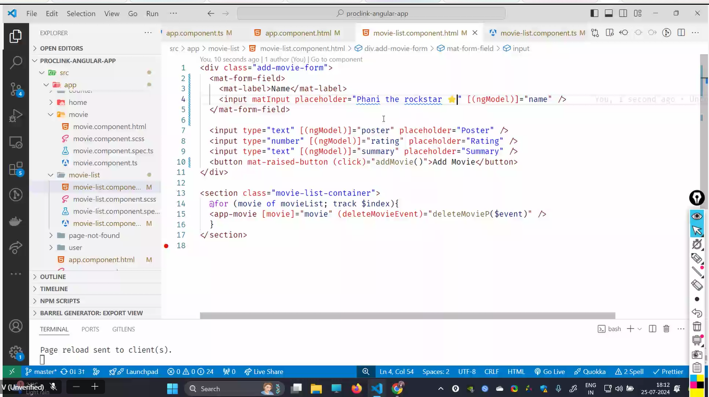
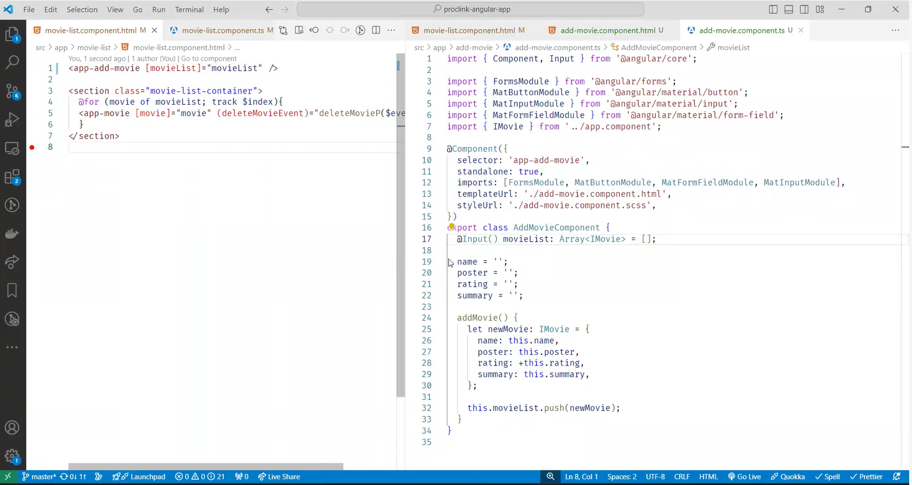

# angular

it was brought up by google

angular version 1:
its angular js.

angular version 2+:
is angular

angular 18 --is current version.

from 1 to 2 :
its completly new frame work., so it was difficult for developers to change, everthing.

api methods are same.
somany boost in features were added to increase the performance.

# state of web-Before Angular:

Google engineers, developed the framework known as AngularJS and officially released it in 2010.

popular in 2012.
Android was boom in 2012.
2012-->mobile net was cheaper.

before vs after:

call rate cutter
sms pack
internet pack
roaming charge

---


in google apps, angular is running behind the scenes.

example:google analytics., its uses angular.

we shuld never mix jquery with angular.

in yt analytics, some of them are running in angulr.

# effects:

1. drop in barrier to entry to the internet.
2. huge mboile traffic
3. huge business opportunity.

features:

1. making app more responsive should be easier.
2. app should not drain battery life.
3. app should load faster, even if network is not there.(up and down), app should be function.
   its called as resilient.

# web app:

user interaction, data affect the others experiences or their own experience.
they have the freedom to affect other ppl experiences or their experience.

# website:

the data will always be static.  
everybody will have same experience

## awwwards.com: new websites link.

---

angular

webpack+babe;-->transalotr/compiler

## htm+css+js

---

how did they achieve? all those features :

features:

# 1 . featur :Spa :

# SPA VS MPA

single page app vs multi page app.

1. in normal apps, each page is html file.

each html file, page will refresh everytime and load.

it will download again and again.

2. but in agular, there is only one html file.(index.html)

it will change the part which is highlighted.

through spa, part which is getting changed, only that we will load.

generally we will do it:
fetch the data,
dom methods to put on screen

angular will make this easier.


doing all these we get the smooth experience.

advantages of spa:
there is no refresh.
smooth performance
data saving-better caching(battery is not uses)
we are not loading, can be done in low network also.


fluid is spa.

# sequential experience

equal load time., its always will be slow. , initial load is slowe

# fluid experience

in fluid, the html part in js is higher,

initial load takes sokme time, its loading all the html pages.

way/solution:
we can split the code, and that alone we can load.

others which are not needed , can be loaded later.

this is called-->lazy loading/code splitting.

loading the background.

2. # feature: resuability:
   
   reusing the components.
   by declaring one time.

pattern:
view+logic--having in one container an re use it. 'this is called as component.

they copied from react.

view==>css+html
logic===>js

---

# process for creating angular projects

npm install -g @angular/cli(this should be downloaded in cmd).
then create a folder.
ng --version
ng new my-first-project
cd my-first-project
ng serve


ng run serve---to run the project.\

ng genric component component_name.(this is called scaffolding)

B2B companies use angular.

# structural director.

: ng if, ng for.(conditinally render)

(on condition they will load.)

# how angular is working behind the scenes.

view page source will give the data, files before loading js
in inspect it will give after loading the js .

<no script> tag is used, when there is no java script or js is off., whatever which is inside the no script, will be printed./displayed.

why js is offed?

wen broswer was weak, they swictched off the js.

the things which we write in htm file, will convert into .js behind the scenes in angular.

if js is not there, entire app will shutdown.

- angular will track the elements , to improve the performance
  like updating the particular elements.
  if no track is there, everything will get re render.
  it will be speed,only particular will rerender.

  ***

# process for using @for


in app component.ts, we need to add template @for and call the components from user.ts.

in html, we will call the selector of user.
and @for to show it on screen

# types of binding:


we can keep html file inside for loop,
,
but calling selector<app/.user > is having higher code quality.

the two main advantages are:

1. maintainability
2. reusability.

3. Property Binding:

   name is property of user,
   name is the property we are binding it to user.name
   so we are writing as

   ```js
   [name] = "user.name";
   ```


instead of giving somany inputs we can give like the above picture

if we want to pass down the data we use @input.
so this is called as drilling down the data.  
 in react it is called, data drilling.

why we are doing this?


we do all this to keep all the data in app component.

why are we dng this?
this is called pattern:
smart and presentation component.
here movies is the presenatation component.  
movielist is the smart component.

smart component will work with db.(fetching)
and presentation will display.

why?
we can reuse the movie component n number of times.

# like button:


model to sync---->view.
angular is doing automatically syncing,
update the model, view will also get updated.

<button (click)---this is event binding

3. two way binding:

its a combination of event and property binding.


if i change the model, view gets changed.

this is called banana in the box.

---this we have done smart and presentation.


  
clr is the property value of clr.

should learn ng if, ng for.

# two way binding:

we import formsmodule, to support ngmodel.

if we chnage the view, color is the model.
color gets updated, view is out of sync.

view gots updated, model got updates, since model updated, view get updates.
starts with view, and ends with view.

for example if we are writing color in text box, (view), model gets updated, and in view color will be displayed.

--this is giving typescript

  


 2. github 3. congigure the netflify 4. 5. 5. 5.  6. depploy

@if, will remove from the dom.
display none will not remove from the dom.


native apps-->android user.
web apps are more better than native apps.

why routing?

when no routing:

1. hit refresh u are lost.

2. cannot bookmark.

when we have routing:

1. organised.
2. ease of acess
3. shareing url.
4. secure route(i should show some things, only if they are logged in.)

current problem:  
it has only one html file.

routing in old web apps:more waiting.

solution:

- smooth routing.

mapping:


2.place holder, what to display.


with href(change the url), the load the page, it will load.
with router link: sam as href, but no refresh.  
<router-outlet>
is for display

# redirect:

wen lost to page,
then:


wheen we need redirection:


how to re-direct:

path film full means excatly it need to match.

deleting movie:


  


from child to parent-->its @output

from parent to child --->its @input
either input or output we will keep in child component only , instead of keepin in app(or parent) component.


dng opp of it.


# process of @output

  


this @output is used for deleting the particular movie.
movielist-->parent
movie is the child.

in movie we should write @output.
//delete movie:


final:


# angular material


is from google.
its

# add button


for dislike


# add-movie





# singleton

there is a problem,
after routing, /movies means, movielist component. '/add means addmovie component.

these both are siblings.
they are not parent and child,
so other concept is introduced, called "service",
it can share data amoung many components.

it is called as "singleton".
it means , create one obj, of this class., and share it with everyone.
it canbe used in multiple components.
its like global variable.

keep the global data.

# how to create a syntax for service.


only one object is created for particular class.


add imports


  


