js is multi thread or multi thread?

it is single thread,but it is aynchronous.
for eg: in a kitchen, only one cook will do all the things.
smart cook, one cook and multiple stoves.

if we write asynchronous code:
we can do it speedly,

deadlock:
there is no multiple threading.

behind the scenes.

stack:

LIFO/FILO

queue:
FIFO/LILO
use the word concurrent, while explaining asynchronous.

is setTimeout part of js?

No.

then how is it working?
because its part of browser, these are part of #web apis.
set timeout is inside the we apis

broweser code is return in c++(native code)

call back:

always involve the time component.

````js
 1. Timer
      // setTimeout(() => {
      //   console.log("Hi, this is Nikhil 🙋‍♂️");
      // }, 5000);
      action--5 seconds.
      trigggers the another action: callling that function after 5seconds

      call back function:the function which is being called., wen action completes.

      //action->reaction
      // action has to complete-->triggers the another action.
// this is example.

    //   action 4 am is happened-->he will knock the door

      ```
in hulk exmaple, it is not a call back function, it is syunchronous, the function is being called after other function.
hulk example is in lexical scope concept. there it doesnot contain any time component.


````

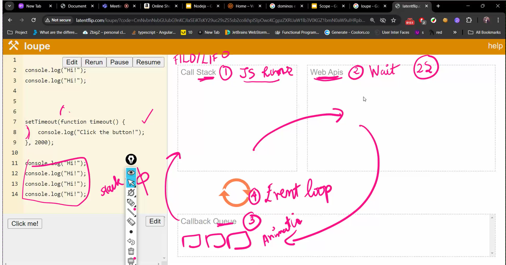

```js
console.log("hi"); // call stack
console.log("hi"); // call stack
setTimeout(function timeout() {
  //web api
  console.log("Hi, this is Rishi 🙋‍♂️");
}, 2000);
console.log("hi"); //call back
console.log("hi"); //call back
console.log("hi"); //call back
console.log("hi"); //call back
```

1. call stack:js runs in call stack only
2. we Apis:wait, it will wait for 2 seconds,the synchronous will complete fast,
3. call back queue:
4. event loop: pushing from queue to stack, when stack is empty..

js can run only in call stack.

timeout will get executed, only wen the stack is empty.
web apis:wait

which ever comes to web api, they are asyunchronous,

what the synchronous code are blocking code, it is blocking the synchronous code.


1st ferrari wins will print.
1st the set timeout will go to web api's, after 2seconds, it will go to call back queue and the before the 5 seconds will get printed, the 2 seconds will go to call stack and the output is printed.

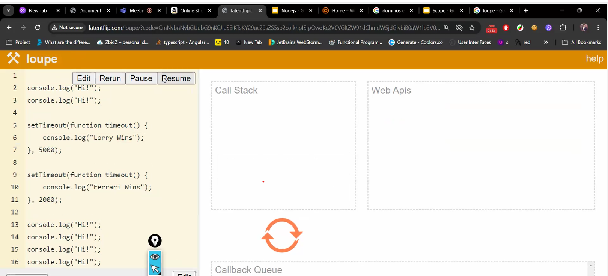


RangeError: Maximum call stack size exceeded.

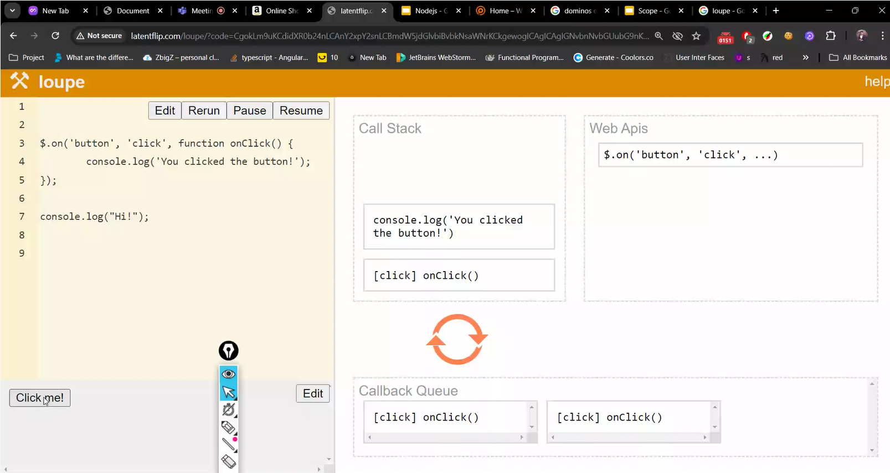
still we click on click me it waits in web api.

some of the aysnchronous are :
event listners----on click()
set time out
call backs()

async vs sync:

# call back hell

// debugging is the hell.  
 //nesting of call backs is called call back hell  
 // this is call back hell,  
 // this consists of iluminity triangle  
 //call back hell can be improved by promises.  
//fetch is for data to come back from web apis., we dk the time limit // web api it will wait ,until data come backs from db  
//call back was invente, dk how much time will it take

# promises state:

      we ca wraap the aysnchrnnous func,
      so that we cant go to call back hell
       1. pending
       2. fulfilled.
       3.Rejected


       promise.resolve(3)
       w e get  fulfilled

       promise.reject(3)
       error

```js
// promise creation
//as  a developer we wont do it
let drivingeligibilityTest = new Promise((resolve, reject) => {
  let age = 14;
  if (age >= 18) {
    resolve("yes u are eligible");
  } else {
    reject("try after u are 18");
  }
});
//promise is a class, it has some methods

// only resolves happen, then .then  will happen
drivingeligibilityTest // when promise completes;
  .then((msg) => console.log("congrats:" + msg));
// positive scenerio, resolved then promis will go to then

// in negative scenario., catch is used
drivingeligibilityTest // when promise completes;
  .then((msg) => console.log("congrats:" + msg))
  .catch((msg) => console.log("oops" + msg));

  console.log(type of drivingeligibilityTest);


```

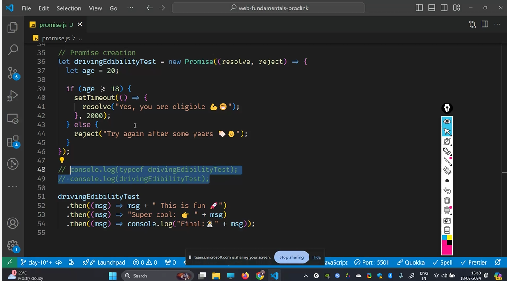

.then is the promise object,thats why we are able to do chaining.

// negative case
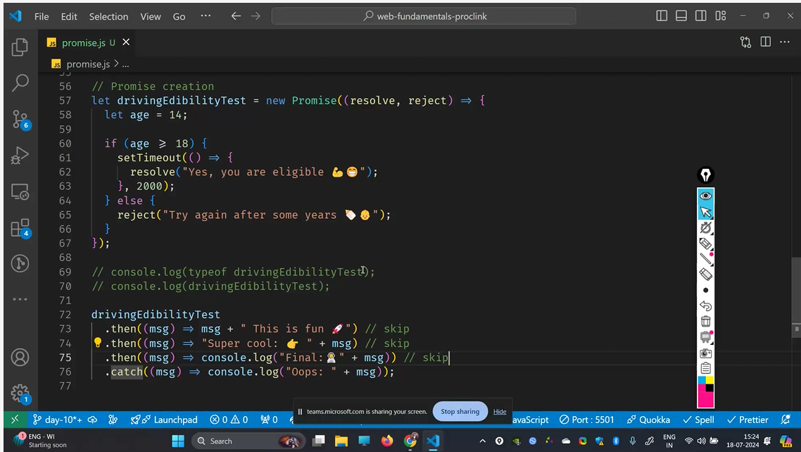

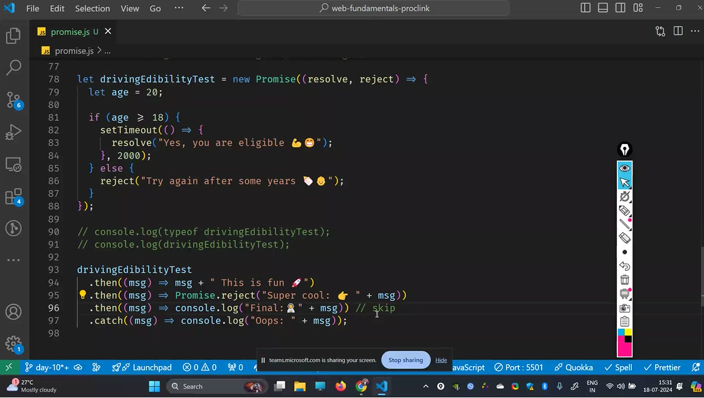

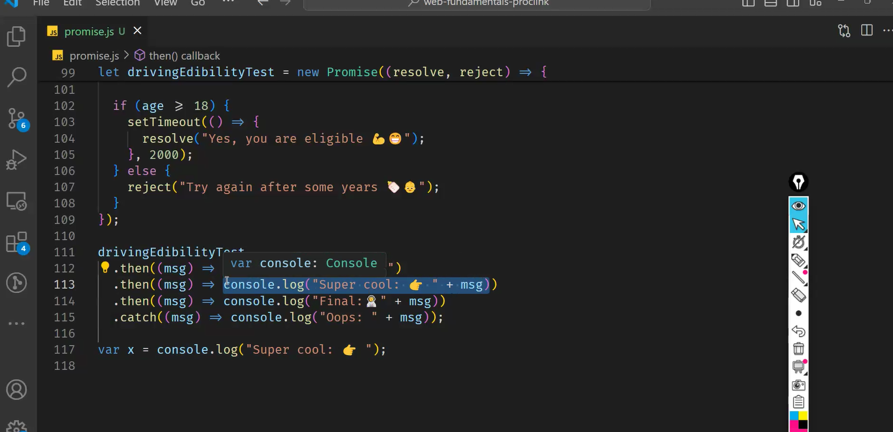
console log doesnot return anything, it will give undefined.

# promises in real life.

black box programing:

rest api: interface betwwen the front end and back end.
we will get the data in the form of json.

get give the url, as fe, and be people willl read th e url

url is the api end pooint

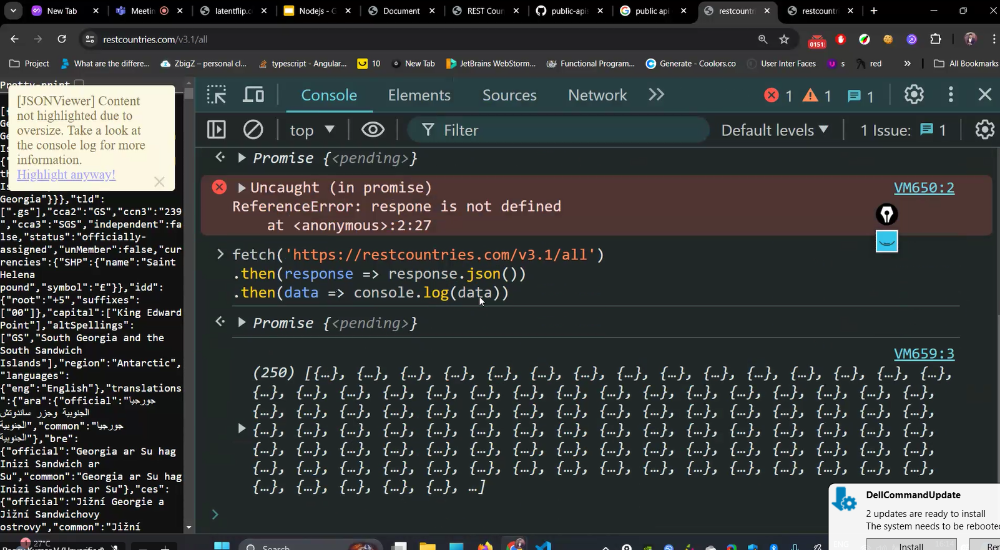

# Multiple Promise

```js
//promise.all , promise.race

let p1 = Promise.resolve(2);
let p2 = Promise.resolve(3);
let p3 = Promise.resolve(4);

// to get 2
// p1.then((num) => console.log(num));

promises
  .all([p1, p2, p3]) //[2,3,4]
  .then((value) => console.log(value));

// its like race:

promises
  .race([p1, p2, p3]) //2
  .then((value) => console.log(value));
```

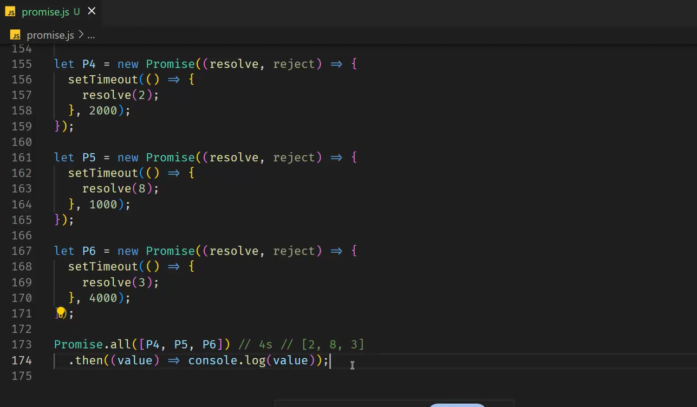
for all the op is [2,8,3] irrespective of time.
and for race its completing in 1s so that is gone print

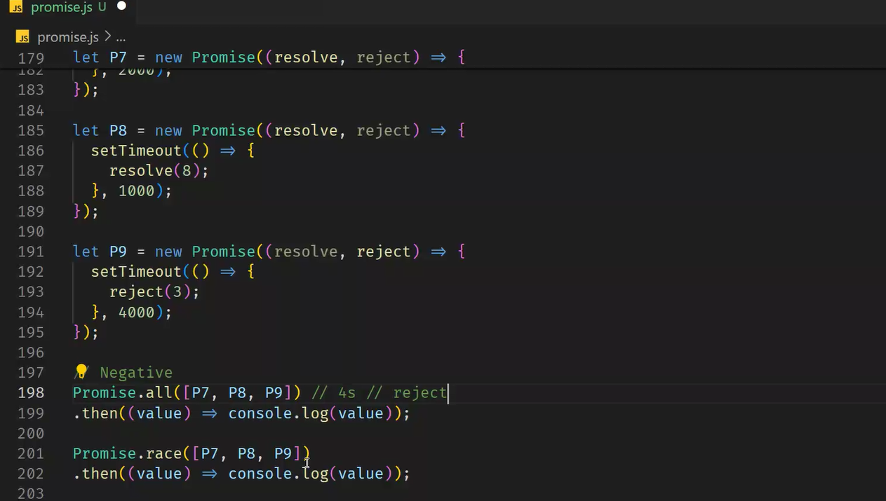
here even though one is rejected, then all will rejected.

for race it is 8.

// promise.all
//1. waits till all promises completes.
or
waits till one get rejected.
//2. any one errors|goes to catch block. 3. in error case u dont get the other promise value.

// promise.race
//1. waits till any one promise completes
//2. when the fastest one gets reject, then it will error out.

promises.allsettled:

1. waits till all promisescompletes
2. always goes to .then
3. always return an array of objects.
4. it has keys:(status:resolved/rejected, values)

promises -->.finally
its is for cleanup code or login purposes.
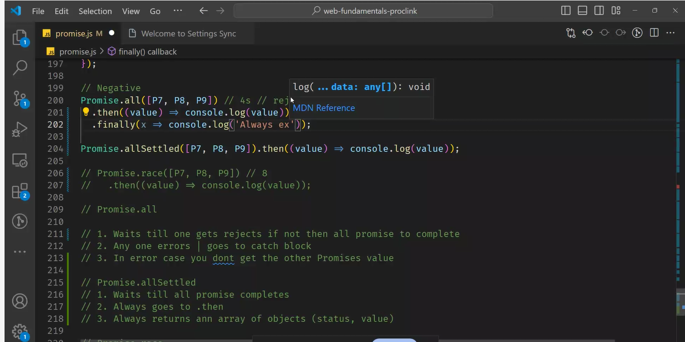

# situation wer race is used?

```js

set Timeout(()=>{
  console.log("");
  prmises.resolve()
})
//in this case 1st promises will exceute and then set timeout, the 2 queues are present and vip queue consists of promises,


```

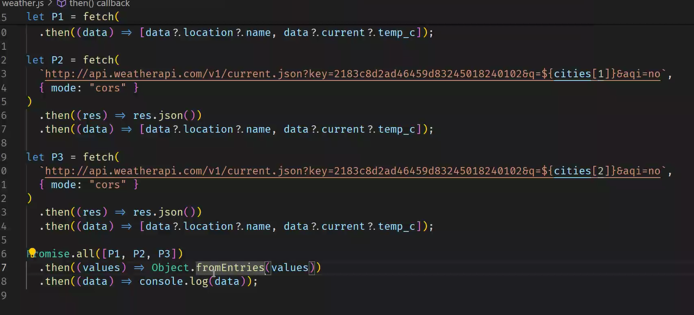

when the data is deleted in postman, its shown in frontend.
why?  
to show the notification to the people,users.

why script tag is used at end of body instead of header in html?
because rendering should happen.

//race-condition:

//payload we are sending in the body.

image ,
name,
price
