parseInt('string',radix)
radix is the sytem to which it belongs to.
2--binary
16--hexa decimal
10--decimal.
parsInt('100',2)
-- the 100 number is given as binary number, the radix number is given as 2.
so the output will be 4, 100 integer value is 4.
original data--server
cache means copy of the daata. whenever u test test it with enable cache. in inspect.
6 requests for one connection.(tcp)

status code-request is approved.
angular material website

# floating

,

this is myth.
it follows 2 steps.

1.  declaration
2.  execution

js guy is js engine.
context guy--execution context


initialisation means creating a space in memory.  
 assignment is storing the value in the memory.  
 temporal dead zone:
it is applicable only for let and const.
it is the zone wer the initialisation is not done.
the variables are stored in that area. since these are un initialised. until they get initialised.


# shadowing

wen ever we declare the variable is declared in the function,
the same variable is declared in outside the function, then it will accses only the varibale which is present in
the function with same name instead of getting outside variable.

# functions:

first class citizens:
why?
three rules should be followed.

- function can be treated as value.

1. function can be passed tp another function
2. function returing the other function
3. assigning function to the variable


function is placed in side the function,

we will use it in higher order function.
function taking function as argument
hof is greeting here.

here say hello is renamed with sayhello fucntion.


when function does not have name, then it is unanynomous function.


if func can be treated as value, then they are treated as fist class citizens

# lexical scope.

outside the function having scope.

own scope+lexical scope

# closure


example:


for var and let :
inside cannnot be accessed by outside.
it dies inisde the block.

for var ---function scope(can be accessed the block)

for let--block scope


---

# diff between var,let,const


let---> we can reassign
can change the value
block cope

const--> it can be never changed then it is we an use.  
no change to value.
it is in block scope
var-->
can change the value  
function scope(block scope escape)

# ARRAY METHODS

1. PUSH
   

MRF--->MAP,REDUCE,FILTER ARE THREE OTHER METHODS.

if the value is directly getting assigned, then the addressi changed.
so it is copy by reference.
we can use spread operator,
we can make a copy and use it and do modifications.
imutablity guranteee the value.

(table with methods, which are mutable and immutable)
methods which doesnot mutate
map will always make a copy
in reverse , some method is there which doesnot mutate.

use a method which always give you copy,

how and why immutation is useful and important.?
when we dont want to check 1000 lines of code.

# slice

number as argument

# join

arr=[]
join will always return string, it doesnot do chaining.

# split


method immutable mutable
slice immutable ✅ ❌
join immutable ❌
split (string method) immutable ❌

# map

arrow function:

```js
const add = (a, b) => a + b;
```

map is the higher order function
It returns copy of the array.(immutable)
It will transform the data type.
eg:array of number to array of strings
length of input shuld be equal to output

Array objects=>array strings

```js
 const a=[5,9,10,11]
var.map(x=>x*2)
a.filter(x=>x>5)
```


# filter

==1.copy of the array 2. length of input length>= length of output length 3. filter doesnot transform datatype.


//

question:
([1,2,3].map(x=>x*3)).map(y=>y*3)
how many times map function can be used.

how many times map,filter can be done.
how long i can cont the pattern
because
they both always returns an array, this is called chaining.
join doesnot return array, it returns string, so it stops chaining.
it should always return array


ES6 FEATURES:

> LET&CONST  
> TEMPLATE LITERAL (back tick)  
> SPREAD OPERATOR  
> REST OPERATOR  
> DESTRUCTIONG  
> CLASS' ARROW FUNCTION==>  
> PROMISE  
> NUMERIC SPEARATORS 1_00_00_00  
> nullish

- function goes to argument. in map

tosorted will return the copy. immutable

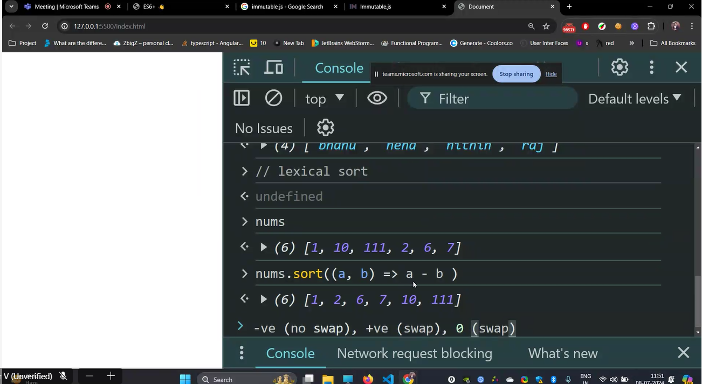
it will change the algorithm based on the size.
nums.sort((a, b) => a - b )
this will give ascending.
to get descending use b-a

# array method--every

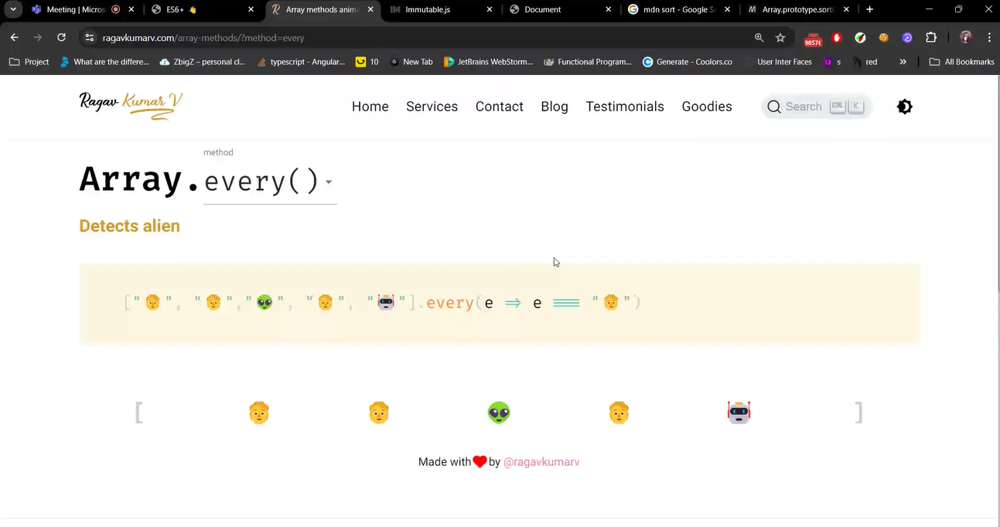
every person is human, alien is there, thats why its false.  
this ressembles and operator.

# array method--some

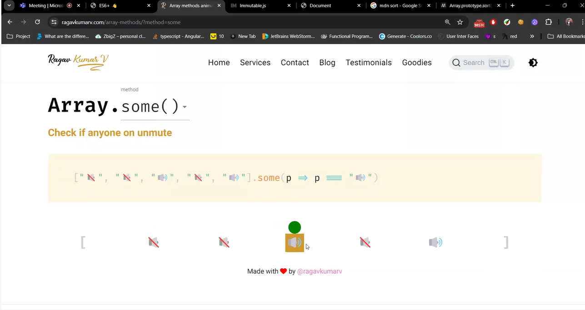
this ressembles "or" operator.

# array method--includes

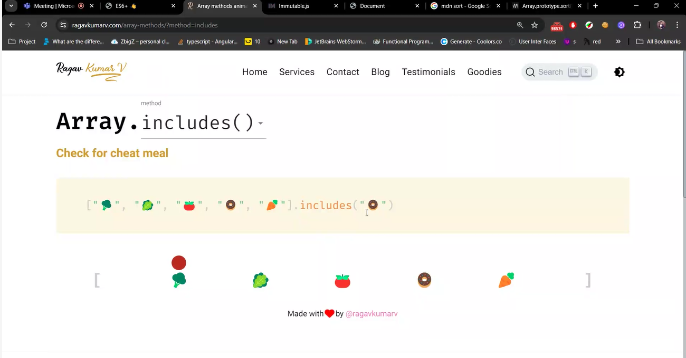
it will check if particular item is present or not

it is similar to some.

https://resources.ragavkumarv.com/slides-javascript-day-2--es6/7

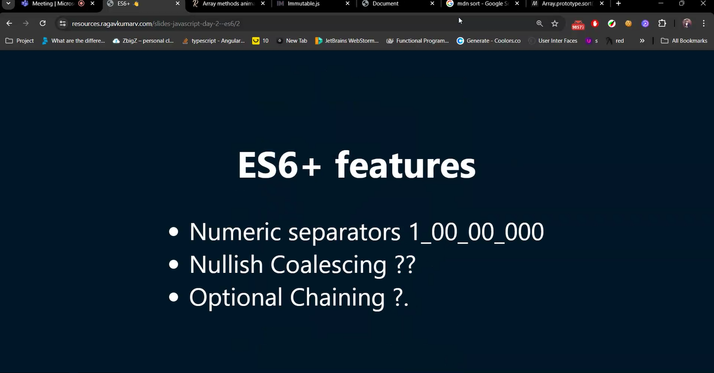

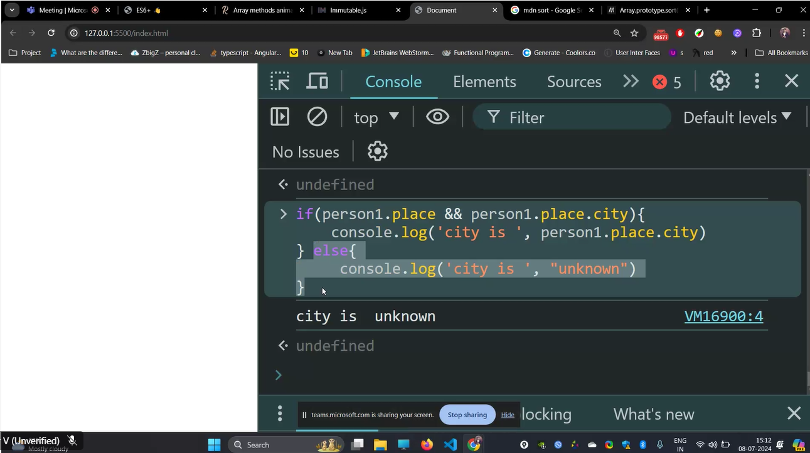
this is defensive code.
there is a better way to write, just to get city and without error out.
we can use optional chaining

wen normally person1.place.city is used then error comes
person1?.place?.city
--it doesnot give error,it gives undefined.

```js
const person1 = {
  name: {
    first: "Alice",
    last: "Johnson",
  },
  age: 28,
  favoriteColors: ["blue", "green"],
  place: {
    //     city: "Chennai",
  },
};

if (person1.place) {
  if (person1.place.city) {
    console.log("city is not known");
  } else {
    console.log(person1.place.city);
  }
} else {
  console.log("city is unknown");
}

//or
person1?.place?.city;
// ?.--optional chaining
person1?.place?.city || "unknown";
//if person1?.place?.city is falsy, then unknown is given as output

// null,undefined as taken as falsy in nullish colleasc,
//or use
```

// if key name and variable name are same then it can be shortend--object shorthand

brackets is required to say its one object.

# reduce

can go from array to any datatype.
reduce(takes function as argument)
.reduce((acc,curr)=>acc+curr,0)
2nd argument is initial value of accumulater.
final value will be the accumulator value.

what map did, reduce can also do.

const sum=[1,7,3,10,5].reduce((acc,curr)=> acc.concat(curr\*2),[])
const sum=[1,7,3,10,5].reduce((acc,curr)=> acc.concat(curr2),[])

--todays task.

--create map with reduce
--create filter with reduce.

--to sorted,tosliced are the immutablity version.
it will not change the original version

# diff between find and filter

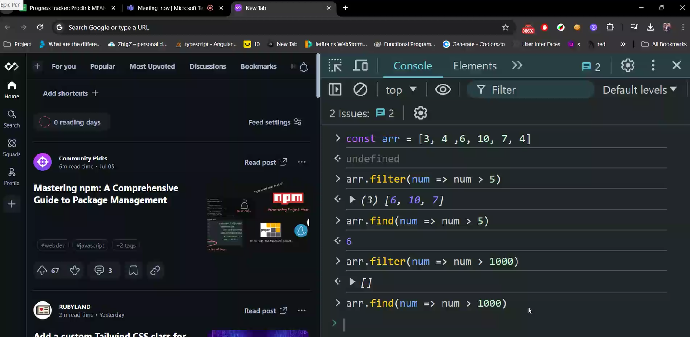

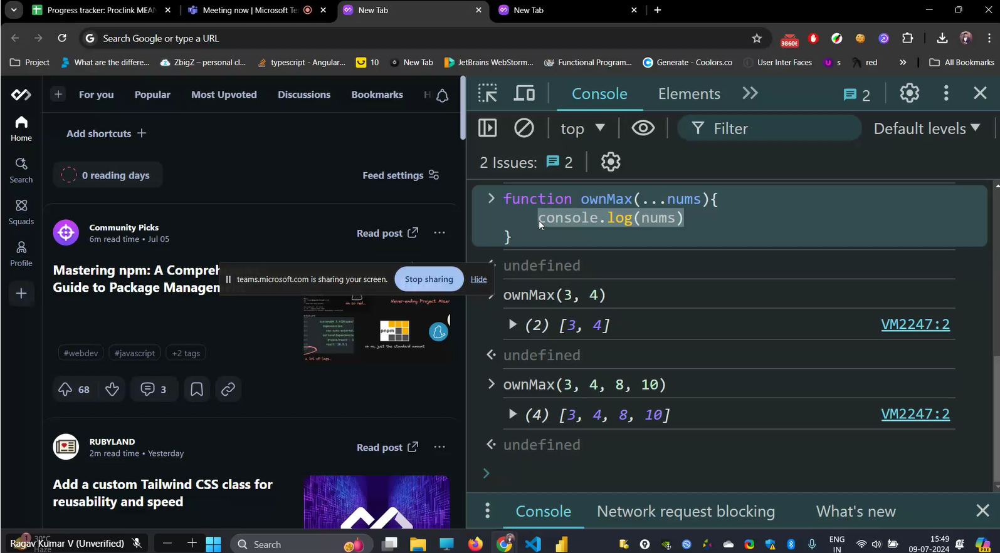

solution of question 4 using destructuring.
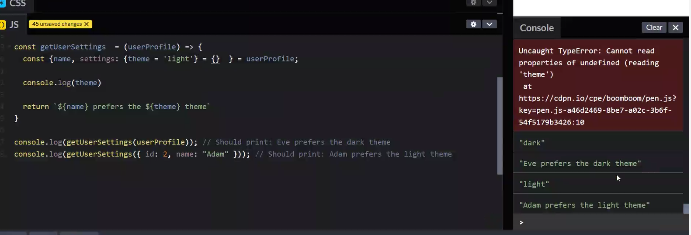

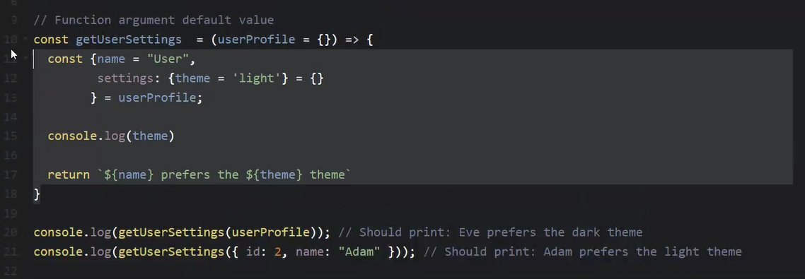

# codeopen.io is the place to code js.

question 5:

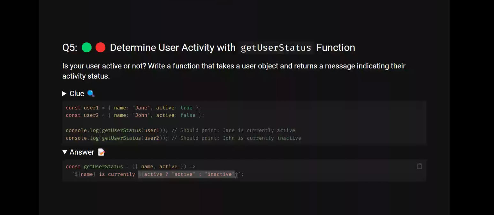

interpolation we can keep expressions and not statements.

expressions means returns the value.

so we can keep this in interpolation'
instead of ternary operator we can keep any expressions
//9 solution
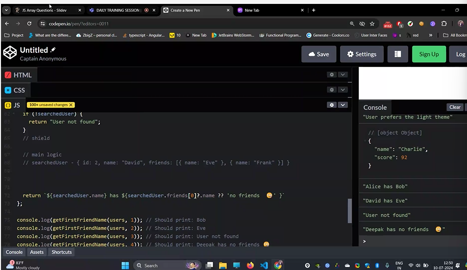
--or
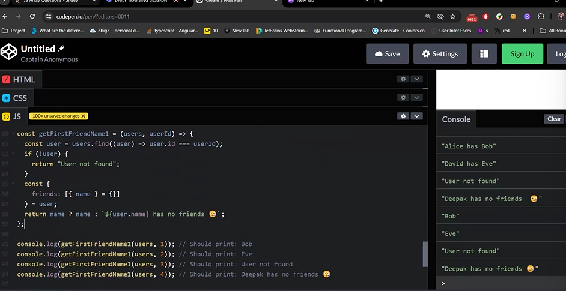
11th sol
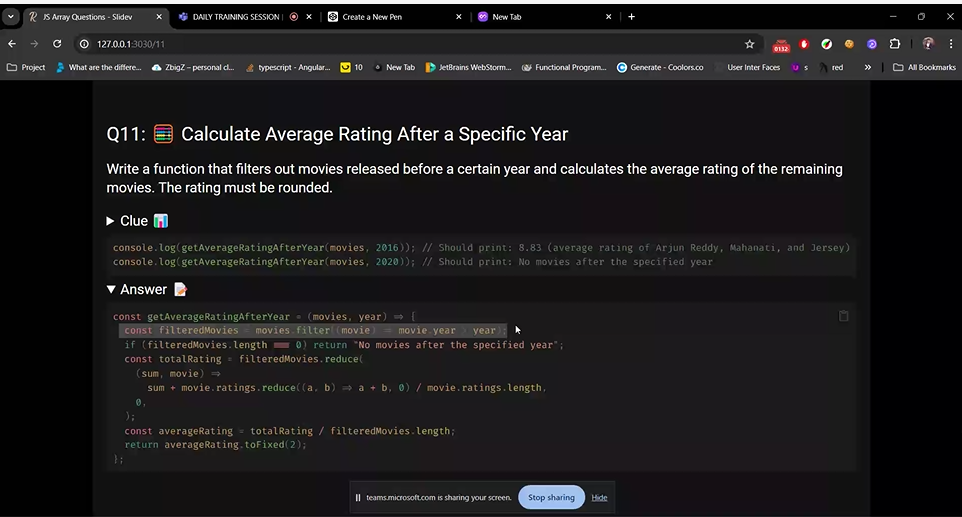

predicate returns boolean value
write a functon inside the every, then
every is the hof and the arrow function is the
predicate value.
16th:
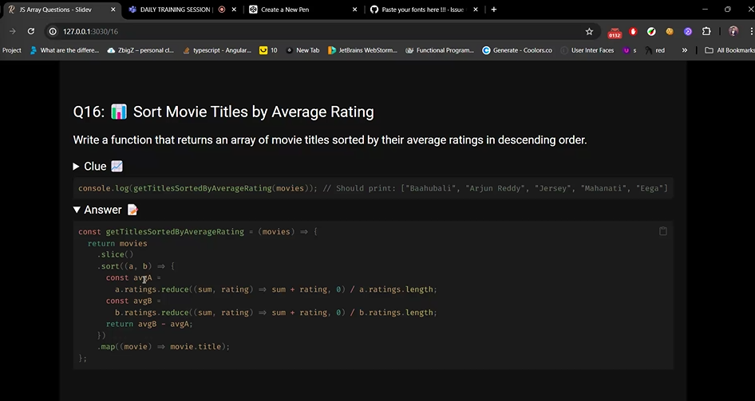
17th sol:


# json :

functions are not present in json.
it is a string  
 convert objevt to json:  
 JSON.stringgify(object name)

js object:
functions can be used
accessed with dot operator is done.

json:
no functions are valid.
string methods are worked.
accessed with dot operator is not done, since its string, it will give undefined.

advantages:
everyone can understand.
loose coupling.

converting json to js object:  
is parse() method.

converting to json---serialisation( so that it can understandable in every languages )
from json to js object ---de serialisation.(parse)

why this term?

# deep copy:

# shallow copy:

var x=[[1,3,4],[1,2]]
var y=[...x]
y[0]=[1,3,4]
y[0].push(10)
y[0]=[1,3,4,10]
x[0]=[1,3,4,10]//copy of reference
then shallow copy happens.
one more level deep, then both arrays get changes
var x=[[1,3,4],[1,2],8]
var y=[...x]
y[2]=100
then x is var x=[[1,3,4],[1,2],8]//copy by value.

# deep copy:

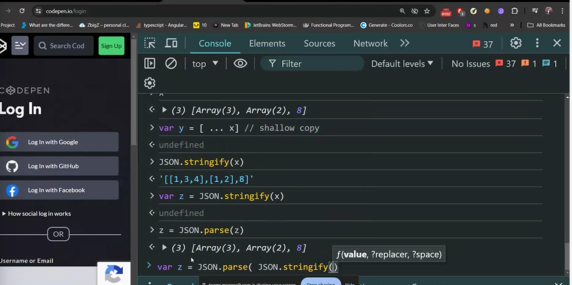
(it creates new memory location
and there is no copy by reference.)

we dont want a shallow copy.

- - if we have nested arrays , then copy of reference takes place and
    values get changed.
    so we use deep copy

to make a deep copy, we use stringfy and parse methods, this will give
it creates new memory location
and there is no copy by reference.

if key and value names are same, then object short hand
i functions , then it is methods short hand.

# object methods:

object.keys(object name)
object.values(object name)
object.entries(object name)//it gives both key and values into array
object.fromentries()// from array key value pair to key value object pair.

## imperative and declarative coding

- imperative-step by step(how to do)
- declarative-what to do
- code must be more declarative than imperative
  it reduces the number of lines keepin in mind.
  functional programming encouraging to declarating coding.

these styles (functional programming, object oriented, procedural style,mathematcial style )are paradigm

functional programming :
pascal

functional related programming:

what is currying with example , how it can be applied in real life.
what is partial application.?
what is point free coding?

# declarating :

it says more what to do, instead of how to do.

## what is Currying?

Currying in JavaScript is a functional programming technique where <big>a function with multiple arguments is transformed into a sequence of nested functions, each taking a single argument.</big>

- The result is a chain of functions.

- each of which function returns another function until all arguments have been supplied and the original function is ultimately executed.

```js
// Regular function with multiple arguments
function multiply(a, b, c) {
  return a * b * c;
}

// Curried version of the multiply function
function curryMultiply(a) {
  return function (b) {
    return function (c) {
      return a * b * c;
    };
  };
}

// Using the curried function
console.log(curryMultiply(2)(3)(4)); // Output: 24

// Or using it step by step
const step1 = curryMultiply(2); // step1 is a function that expects 'b'
const step2 = step1(3); // step2 is a function that expects 'c'
const result = step2(4); // result will be 24

console.log(result); // Output: 24
```

```js
// Non-curried function
function greet(greeting, name) {
  return `${greeting}, ${name}!`;
}

// Curried version of the greet function
const curriedGreet = (greeting) => (name) => `${greeting}, ${name}!`;

// Using the curried function
const greetHello = curriedGreet("Hello");
console.log(greetHello("John")); // Output: "Hello, John!"

const greetGoodMorning = curriedGreet("Good morning");
console.log(greetGoodMorning("Alice")); // Output: "Good morning, Alice!"
```

## What is partial application

Partial application is a way to create a new function by fixing some of the arguments of an existing function.

- it allows you to fix a certain number of arguments to a function, creating a new function with fewer parameters.

```js
function add(a, b) {
  return a + b;
}

function addPartial(a) {
  return function (b) {
    return a + b;
  };
}

// Usage:
const add5 = addPartial(5);
console.log(add5(3)); // Output: 8
```

## What is point free coding

function definitions do not include named parameters. Instead, functions are defined in terms of other functions, usually using function composition and higher-order functions

- combining simpler functions to create more complex functions without explicitly referencing the arguments of the functions involved

```js
// Non-point-free style
const numbers = [1, 2, 3, 4, 5];
const squaredEvens = numbers
  .filter((num) => num % 2 === 0)
  .map((num) => num ** 2);

// Point-free style
const isEven = (num) => num % 2 === 0;
const square = (num) => num ** 2;
const squaredEvensPointFree = numbers.filter(isEven).map(square);

console.log(squaredEvensPointFree); // Output: [4, 16]
```
