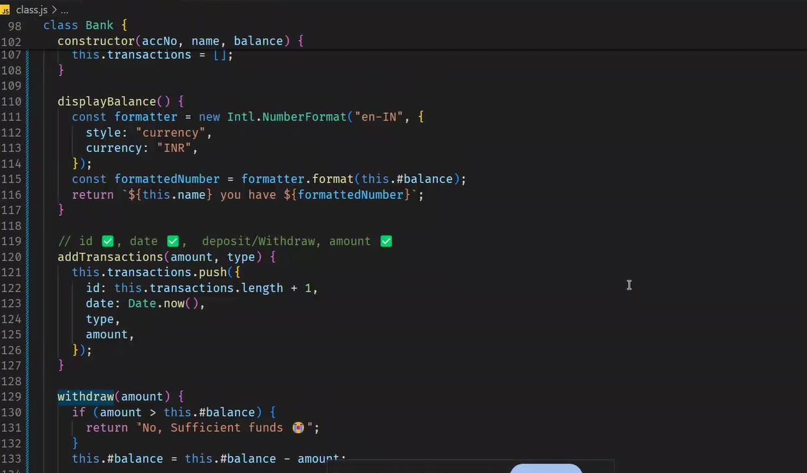
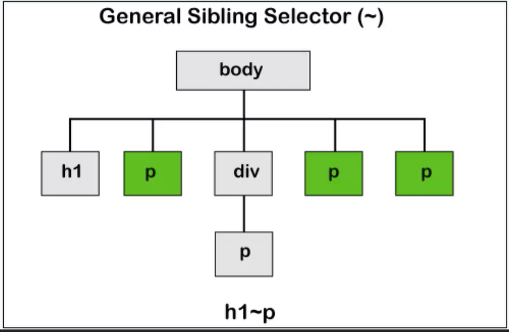
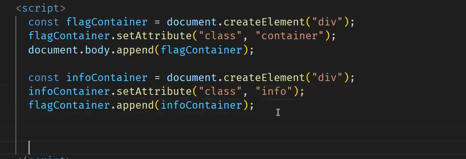

parseInt('string',radix)
radix is the sytem to which it belongs to.
2--binary
16--hexa decimal
10--decimal.
parsInt('100',2)
-- the 100 number is given as binary number, the radix number is given as 2.
so the output will be 4, 100 integer value is 4.
original data--server
cache means copy of the daata. whenever u test test it with enable cache. in inspect.
6 requests for one connection.(tcp)

status code-request is approved.
angular material website

# floating

,

this is myth.
it follows 2 steps.

1.  declaration
2.  execution

js guy is js engine.
context guy--execution context


initialisation means creating a space in memory.  
 assignment is storing the value in the memory.  
 temporal dead zone:
it is applicable only for let and const.
it is the zone wer the initialisation is not done.
the variables are stored in that area. since these are un initialised. until they get initialised.


# shadowing

wen ever we declare the variable is declared in the function,
the same variable is declared in outside the function, then it will accses only the varibale which is present in
the function with same name instead of getting outside variable.

# functions:

first class citizens:
why?
three rules should be followed.

- function can be treated as value.

1. function can be passed tp another function
2. function returing the other function
3. assigning function to the variable


function is placed in side the function,

we will use it in higher order function.
function taking function as argument
hof is greeting here.

here say hello is renamed with sayhello fucntion.


when function does not have name, then it is unanynomous function.


if func can be treated as value, then they are treated as fist class citizens

# lexical scope.

outside the function having scope.

own scope+lexical scope

# closure


example:


for var and let :
inside cannnot be accessed by outside.
it dies inisde the block.

for var ---function scope(can be accessed the block)

for let--block scope


---

# diff between var,let,const


let---> we can reassign
can change the value
block cope

const--> it can be never changed then it is we an use.  
no change to value.
it is in block scope
var-->
can change the value  
function scope(block scope escape)

# ARRAY METHODS

1. PUSH
   

MRF--->MAP,REDUCE,FILTER ARE THREE OTHER METHODS.

if the value is directly getting assigned, then the addressi changed.
so it is copy by reference.
we can use spread operator,
we can make a copy and use it and do modifications.
imutablity guranteee the value.

(table with methods, which are mutable and immutable)
methods which doesnot mutate
map will always make a copy
in reverse , some method is there which doesnot mutate.

use a method which always give you copy,

how and why immutation is useful and important.?
when we dont want to check 1000 lines of code.

# slice

number as argument

# join

arr=[]
join will always return string, it doesnot do chaining.

# split


method immutable mutable
slice immutable ✅ ❌
join immutable ❌
split (string method) immutable ❌

List of array methods :

           immutable     mutable (modify the orginal array)   return type

concat ✅ ❌ array

slice ✅ ❌ array

filter ✅ ❌ array

map ✅ ❌ array

reduce ✅ ❌

forEach ✅ ❌

every ✅ ❌ boolean

some ✅ ❌ boolean

push ❌ ✅ number(it returns the length of array)

pop ❌ ✅ any(the element removed from the end of the array)

shift ❌ ✅ any(the element removed from the begining of the array)

unshift ❌ ✅ number(it returns the length of array)

splice ❌ ✅ Array(an array containing the elements removed from the original array)

sort ❌ ✅ array

reverse ❌ ✅ array

has context menu

# map

arrow function:

```js
const add = (a, b) => a + b;
```

map is the higher order function
It returns copy of the array.(immutable)
It will transform the data type.
eg:array of number to array of strings
length of input shuld be equal to output

Array objects=>array strings

```js
 const a=[5,9,10,11]
var.map(x=>x*2)
a.filter(x=>x>5)
```


# filter

==1.copy of the array 2. length of input length>= length of output length 3. filter doesnot transform datatype.


//

question:
([1,2,3].map(x=>x*3)).map(y=>y*3)
how many times map function can be used.

how many times map,filter can be done.
how long i can cont the pattern
because
they both always returns an array, this is called chaining.
join doesnot return array, it returns string, so it stops chaining.
it should always return array


ES6 FEATURES:

> LET&CONST  
> TEMPLATE LITERAL (back tick)  
> SPREAD OPERATOR  
> REST OPERATOR  
> DESTRUCTIONG  
> CLASS' ARROW FUNCTION==>  
> PROMISE  
> NUMERIC SPEARATORS 1_00_00_00  
> nullish

- function goes to argument. in map

tosorted will return the copy. immutable


it will change the algorithm based on the size.
nums.sort((a, b) => a - b )
this will give ascending.
to get descending use b-a

# array method--every


every person is human, alien is there, thats why its false.  
this ressembles and operator.

# array method--some


this ressembles "or" operator.

# array method--includes


it will check if particular item is present or not

it is similar to some.

https://resources.ragavkumarv.com/slides-javascript-day-2--es6/7


this is defensive code.
there is a better way to write, just to get city and without error out.
we can use optional chaining

wen normally person1.place.city is used then error comes
person1?.place?.city
--it doesnot give error,it gives undefined.

```js
const person1 = {
  name: {
    first: "Alice",
    last: "Johnson",
  },
  age: 28,
  favoriteColors: ["blue", "green"],
  place: {
    //     city: "Chennai",
  },
};

if (person1.place) {
  if (person1.place.city) {
    console.log("city is not known");
  } else {
    console.log(person1.place.city);
  }
} else {
  console.log("city is unknown");
}

//or
person1?.place?.city;
// ?.--optional chaining
person1?.place?.city || "unknown";
//if person1?.place?.city is falsy, then unknown is given as output

// null,undefined as taken as falsy in nullish colleasc,
//or use
```

// if key name and variable name are same then it can be shortend--object shorthand

brackets is required to say its one object.

# reduce

can go from array to any datatype.
reduce(takes function as argument)
.reduce((acc,curr)=>acc+curr,0)
2nd argument is initial value of accumulater.
final value will be the accumulator value.

what map did, reduce can also do.

const sum=[1,7,3,10,5].reduce((acc,curr)=> acc.concat(curr\*2),[])
const sum=[1,7,3,10,5].reduce((acc,curr)=> acc.concat(curr2),[])

--todays task.

--create map with reduce
--create filter with reduce.

--to sorted,tosliced are the immutablity version.
it will not change the original version

# diff between find and filter


solution of question 4 using destructuring.


# codeopen.io is the place to code js.

question 5:


interpolation we can keep expressions and not statements.

expressions means returns the value.

so we can keep this in interpolation'
instead of ternary operator we can keep any expressions
//9 solution

--or

11th sol


predicate returns boolean value
write a functon inside the every, then
every is the hof and the arrow function is the
predicate value.
16th:

17th sol:


# json :

functions are not present in json.
it is a string  
 convert objevt to json:  
 JSON.stringgify(object name)

js object:
functions can be used
accessed with dot operator is done.

json:
no functions are valid.
string methods are worked.
accessed with dot operator is not done, since its string, it will give undefined.

advantages:
everyone can understand.
loose coupling.

converting json to js object:  
is parse() method.

converting to json---serialisation( so that it can understandable in every languages )
from json to js object ---de serialisation.(parse)

why this term?

# deep copy:

# shallow copy:

```js
var x=[[1,3,4],[1,2]]
var y=[...x]
y[0]=[1,3,4]
y[0].push(10)
y[0]=[1,3,4,10]
x[0]=[1,3,4,10]//copy of reference
then shallow copy happens.
one more level deep, then both arrays get changes
var x=[[1,3,4],[1,2],8]
var y=[...x]
y[2]=100
then x is var x=[[1,3,4],[1,2],8]//copy by value.
```

# deep copy:


(it creates new memory location
and there is no copy by reference.)

we dont want a shallow copy.

- - if we have nested arrays , then copy of reference takes place and
    values get changed.
    so we use deep copy

to make a deep copy, we use stringfy and parse methods, this will give
it creates new memory location
and there is no copy by reference.

if key and value names are same, then object short hand
i functions , then it is methods short hand.

# object methods:

object.keys(object name)
object.values(object name)
object.entries(object name)//it gives both key and values into array
object.fromentries()// from array key value pair to key value object pair.

## imperative and declarative coding

- imperative-step by step(how to do)
- declarative-what to do
- code must be more declarative than imperative
  it reduces the number of lines keepin in mind.
  functional programming encouraging to declarating coding.

these styles (functional programming, object oriented, procedural style,mathematcial style )are paradigm

functional programming :
pascal

functional related programming:

what is currying with example , how it can be applied in real life.
what is partial application.?
what is point free coding?

# declarating :

it says more what to do, instead of how to do.

# Curring

```js
function add(a, b, c) {
  return a + b + c;
}
console.log(add(2, 4, 7));
```

we have requriement that if we have 3 parameters then we want to add
we get from a parameter from somewhere api
b also and c also

we make 3 variables
function add(a,b,c){
return a+b+c;
}
console.log(add(2,4,7));
let a;
let b;
let c;
we separate 3 and then we search them untill we fins a,b,c we won't perform add

```js
function add(a) {
  return function (b) {
    return function (c) {
      return a + b + c;
    };
  };
}

add(2)(3)(5);
console.log(add(2)(3)(5));
```

# practical ex

```js
function sendAutoEmail(to) {
  return function (subject) {
    return function (body) {
      console.log(`sending email to ${to} with subject ${subject}:${body}`);
    };
  };
}
// const sendAutoEmail= to=> suject=>body=>`sending email to ${to} with subject ${subject}:${body}`;
let step 1 = sendAutoEmail("rishikasairi@gmail.com");
let step 2 = step1("New order confirmation")
let step 3= step 2("hey rishi here is something for you ")

```

# why curring

1. (functions that can take other functions as arguments or return them) makes currying a natural fit. Currying allows you to transform functions into higher-order functions by enabling functions to be passed around and manipulated more easily.

2. Data Transformation: Currying can simplify data transformation pipelines by breaking down operations into smaller functions that can be composed together.
3. Modular Code: It promotes modular programming by breaking down complex functions into smaller, composable functions.
4. Readability and Maintainability:

## what is Currying?

Currying is a technique in functional programming where a function that takes multiple arguments is transformed into a sequence of functions, each taking a single argument.

Currying in JavaScript is a functional programming technique where <big>a function with multiple arguments is transformed into a sequence of nested functions, each taking a single argument.</big>

- The result is a chain of functions.

- each of which function returns another function until all arguments have been supplied and the original function is ultimately executed.

```js
// Regular function with multiple arguments
function multiply(a, b, c) {
  return a * b * c;
}

// Curried version of the multiply function
function curryMultiply(a) {
  return function (b) {
    return function (c) {
      return a * b * c;
    };
  };
}

// Using the curried function
console.log(curryMultiply(2)(3)(4)); // Output: 24

// Or using it step by step
const step1 = curryMultiply(2); // step1 is a function that expects 'b'
const step2 = step1(3); // step2 is a function that expects 'c'
const result = step2(4); // result will be 24

console.log(result); // Output: 24
```

```js
using arrow function:

const RectArea = function (l, b, h) {
  return l * b * h;
};
RectArea(1, 2, 3); // calling Normal Function


const rectarea=(a,b,c)=>a*b*c
```

```js
// Non-curried function
function greet(greeting, name) {
  return `${greeting}, ${name}!`;
}

// Curried version of the greet function
const curriedGreet = (greeting) => (name) => `${greeting}, ${name}!`;

// Using the curried function
const greetHello = curriedGreet("Hello");
console.log(greetHello("John")); // Output: "Hello, John!"

const greetGoodMorning = curriedGreet("Good morning");
console.log(greetGoodMorning("Alice")); // Output: "Good morning, Alice!"
```

## What is partial application

Partial application is a technique in functional programming where you create a new function by fixing a number of arguments of an existing function.

This new function, derived from the original, takes the remaining arguments as its own arguments.

In other words, you create a specialized version of a function by pre-filling some of its arguments, leaving the rest to be supplied later.

```js
function add(x, y) {
  return x + y;
}

const add1 = add.bind(null, 1); // Fixing the first argument to 1

console.log(add1(2)); // Outputs: 3
console.log(add1(5)); // Outputs: 6
```

# partial application and currying together

```js
// Non-curried function
function add(a, b) {
  return a + b;
}

// Curried version of add function
function curriedAdd(a) {
  return function (b) {
    return a + b;
  };
}

const addTwo = curriedAdd(2); // Fixing 'a' to 2
console.log(addTwo(3)); // Output: 5
```

## What is point free coding

function definitions do not include named parameters. Instead, functions are defined in terms of other functions, usually using function composition and higher-order functions

- combining simpler functions to create more complex functions without explicitly referencing the arguments of the functions involved

```js
// Non-point-free style
const numbers = [1, 2, 3, 4, 5];
const squaredEvens = numbers
  .filter((num) => num % 2 === 0)
  .map((num) => num ** 2);

// Point-free style
const isEven = (num) => num % 2 === 0;
const square = (num) => num ** 2;
const squaredEvensPointFree = numbers.filter(isEven).map(square);

console.log(squaredEvensPointFree); // Output: [4, 16]
```

Point-Free style means not specifying arguments for each function application. The term "Point" refers to a function's parameter, and Point-Free means there's no "place" for those parameters. This model aims to make readers focus on what a function does, not caring about the specific names of its parameters.

Returning to a simplest example, we create four functions that, just by looking at them, you can tell what they do:

```js
const testOdd = (x) => x % 2 === 1;
const testUnderFifty = (x) => x < 50;
const duplicate = (x) => x + x;
const addThree = (x) => x + 3;
```

# this keyword:

```js
const student={
  firstname:"aish",
  lastname:"pola".
  fullname:function(){
    return `${this.lastname},${this.firstname};
  }
}

```

=look at the place where function is being called


here context is object name.

this keyword will have a context to object name.


window will work, even if nothig is declared.
a=4
here we didnt use any var,ley,const. but still it will work because,it goes into window object.
if strict mode is on , then it will error out.

# three ways to force context to this.

1. call
2. apply
3. bind

# diff between call and apply


call: binds the this value, invokes the function, and allows you to pass a list of arguments.

apply: binds the this value, invokes the function, and allows you to pass arguments as an array.

when full name doesnot have any arguments, then call and apply are same.
when

bind: binds the this value, returns a new function, and allows you to pass in a list of arguments.

# bind


binding this with student 3 in above example.
tieing them to together.

```js
const student = {
  firstname: "aish",
  lastname: "pola",
  fullname: () => {
    return `${this.lastname},${this.firstname}`;
  },
};
console.log(student.fullname());
```

```js
const student5 = {
  fistname: "manu",
  lastname: "pola",
  fullname: () => {
    return `${this.lastname},${this.firstname}`;
  },
  //arrow doesnot have this value context, so it will see for lexical scope.
  // since lexical scope is not present, it will give undefined, undefined.
};
console.log(fullname.call(student5));
console.log(fullname.apply(student5));
```

what is the diffference betwwen normal function and arrow function:
this context is not accepted by arrow function.
normal function will accept it.


```js
const luffy = {
  name: "Monkey D. Luffy",
  crew: "Straw Hat Pirates",
  actions: {
    gearSecond: function () {
      console.log(`${this.name} activates Gear Second!`); // undefined

      function attack() {
        console.log(`${this.name} attacks with Gomu Gomu no Jet Pistol!`);
      }

      attack(); // undefined
    },
    gearFourth: function () {
      console.log(`${this.name} activates Gear Fourth!`); // undefined

      const attack = () => {
        console.log(`${this.name} attacks with Gomu Gomu no Kong Gun!`);
      };

      attack(); // undefined
    },
    crewShout: () => {
      console.log(`Crew Shout: ${this.crew} cannot be accessed here.`); // undefined
    },
  },
};

// What happens? Clue: Change Context
luffy.actions.gearSecond();
luffy.actions.gearFourth();
luffy.actions.crewShout();

console.log(luffy.actions.gearSecond.call(luffy));
console.log(luffy.actions.gearFourth.call(luffy));
console.log(luffy.actions.crewShout.call(luffy));

// this will point to call , actions is the context here.
// action doesnot contain any name so its undefined for 1st statement

// to change that context we should give as:
// actions.gearsecond.call(luffy); -->
//
```

````js
Let's analyze the provided code and understand the output for each method call.

### luffy Object Structure:

```javascript
const luffy = {
  name: "Monkey D. Luffy",
  crew: "Straw Hat Pirates",
  actions: {
    gearSecond: function () {
      console.log(`${this.name} activates Gear Second!`);
      function attack() {
        console.log(`${this.name} attacks with Gomu Gomu no Jet Pistol!`);
      }
      attack();
    },
    gearFourth: function () {
      console.log(`${this.name} activates Gear Fourth!`);
      const attack = () => {
        console.log(`${this.name} attacks with Gomu Gomu no Kong Gun!`);
      };
      attack();
    },
    crewShout: () => {
      console.log(`Crew Shout: ${this.crew} cannot be accessed here.`);
    },
  },
};
````

### Explanation of Behavior:

1. **gearSecond Method**:

   - Defined as a regular function (`function () { ... }`).
   - Inside `gearSecond`, when `this.name` is used, it correctly refers to `luffy.name`, which is `"Monkey D. Luffy"`.
   - The `attack` function, however, is defined using `function attack() { ... }`, which creates its own scope. Inside `attack`, `this.name` does not refer to `luffy.name` anymore but to the global scope (in non-strict mode) or `undefined` (in strict mode). Hence, `this.name` inside `attack()` logs as `undefined`.
   - **Output for `gearSecond`:**
     ```
     Monkey D. Luffy activates Gear Second!
     undefined attacks with Gomu Gomu no Jet Pistol!
     ```

2. **gearFourth Method**:

   - Defined as a regular function (`function () { ... }`).
   - Inside `gearFourth`, `this.name` correctly refers to `luffy.name`, which is `"Monkey D. Luffy"`.
   - The `attack` function is defined using an arrow function (`const attack = () => { ... }`), which captures `this` lexically from its surrounding context (`gearFourth`), meaning it retains the context of `luffy`. Thus, `this.name` inside `attack()` correctly logs `Monkey D. Luffy`.
   - **Output for `gearFourth`:**
     ```
     Monkey D. Luffy activates Gear Fourth!
     Monkey D. Luffy attacks with Gomu Gomu no Kong Gun!
     ```

3. **crewShout Method**:
   - Defined as an arrow function (`() => { ... }`).
   - Arrow functions do not have their own `this` context; instead, they inherit `this` from the enclosing lexical context (`luffy` in this case).
   - However, when using `this.crew` inside `crewShout`, it tries to access `this.crew` from its lexical scope, which is the global scope (or `undefined` in strict mode), not `luffy.crew`.
   - **Output for `crewShout`:**
     ```
     Crew Shout: undefined cannot be accessed here.
     ```

### Method Calls using `call`:

When you try to use `call` to explicitly set the `this` context for these methods, note the following:

- `call` and `apply` are typically used with regular functions to explicitly set the `this` value. However, arrow functions (`crewShout` in this case) do not respect `call` or `apply` for setting `this`.
- **Output using `call`**:
  - For `gearSecond` and `gearFourth`, using `call` will correctly execute the methods with `luffy` as the `this` context because they are regular functions.
  - For `crewShout`, using `call` will still result in `undefined` for `this.crew`, because arrow functions retain their lexical `this` binding and do not respect `call` to change `this`.

### Summary:

- The main issue arises from the use of regular functions (`function () { ... }`) versus arrow functions (`() => { ... }`):
  - Regular functions: `this` is determined by how the function is called (`luffy.actions.gearSecond()` sets `this` to `luffy`).
  - Arrow functions: `this` is lexically inherited from the surrounding context and cannot be overridden by `call` or `apply`.
- This leads to different behaviors in accessing `this.name` and `this.crew` within the methods of `luffy.actions`.

Understanding these nuances helps in correctly predicting and debugging issues related to `this` binding in JavaScript.

````

not recommeded:
()()
=>()
=>=>
recommended:
()=>


//arrw=ow functions should be placed inside normal functions i.e nest arrow functions inside normal functions

# classes

why do we need claasses:

- we want to mimic the object.
- the features of object can be put in classes.

```js
class car {
  constructor(name, engine, doors, wheels) {
    this.name = name;
    this.engine = engine;
    this.doors = doors;
    this.wheel = wheel;
  }
}
//blue print of the object:
//this context is ferrari object
//new will say , this  keyword should point to the object, that is been created.
const ferrari = new car("ferrari", "v8", 2, 4);
const bmw = new car("bmw", "v8", 4, 4);
const audi = new car("bmw", "v10", 4, 4);
const honda = new car("honda", "CRF-70", 4, 4);
const lamborgini = new car("lamborgini", "v6", 2, 4);

console.log(ferrari);
console.log(bmw);
console.log(audi);
console.log(honda);
console.log(lamborgini);
console.log(typeof car); //function
//behind the scenes it is function
//what ever we do in function, we can do it in car.
````

# methods

```js
class car {
  constructor(name, engine, doors, wheels) {
    //this.name-> member variable,instance variable
    this.name = name;
    this.engine = engine;
    this.doors = doors;
    this.wheel = wheel;
  }
  //(member/instance)(function/method)(member method)
  sound() {
    return "vroom vroom";
  }
}
const ferrari = new car("ferrari", "v8", 2, 4);
```

```js
class Bank {
  constructor(accNo, name, balance) {
    this.accNo = accNo;
    this.name = name;
    this.balance = balance;
  }
}
const accholder1 = new Bank(12341, "aishwarya", 80_000);
const accholder2 = new Bank(12342, "manaswini", 1_80_000);
const accholder3 = new Bank(12343, "rishika", 1_50_000);
const accholder4 = new Bank(12343, "teju", 1_40_000);
console.log(accholder1);
console.log(accholder2);
console.log(accholder3);
console.log(accholder4);
```

# dot operator can be used on objects only.

# auto boxing:

it happens on all primitive types.
string
boolean
undefined
it converts data types to objects, and we can perform all the methods on the number.

private

# abstraction.


# encapulsation:

encapuslate date and logic. putting all together.

member variable&methods-data+logic & access
it also tells who can access what.

data +methods:
array is the class
data is the elements in the array
methods means all the methods which we are using.

whole code:


# adding transactions




to make the methods, varaibles private we need to add # infront of those..

# order of methods:

-static methods
-private methods

- public methods

# inheritance


//----
//savings account-0.06
//Currentaccount-0.03 every transaction we made,
//they are charging rs.10


# html:

# overflow:

overflow:for scrolling.

auto,scroll,hidden,visible

why visible is default:
atleast content is visible.
if it is hidden, then content is not visible.

bootstrap:
was brought up by twitter.
they solved layout problem.(flex and grid were introduced)

responsive:adjust all the things, while minimising,maximizing.
google made responsive.
made responsive by ranking.

# flex

div is the block element., these will respect height and width.

problem with block element is they are occupying extra space.

inline elements we can make it side by side.
if it is inline element, then it doesnot choose height and width even though they are given.  
to make it inline.
display:inline

by using inline block: height and width is respected. we will get side and side.

# inline:

1. doesnot respect height and width.
2. side by side.

# block:

1. element respect height and width.
2. stacked

# Inline block

1. element respect height and with
2. side by side
3. example: images are inline block

why to go with flex and grid?
applied to parent, not child.

default property to display is block.

# flex:

- why to go with flex and grid?
  applied to parent, not child.

- try to match with highest width.
  for flex width is just suggestion.
  -why does it is squeesing:
  everything it will keep it side and side.
  keep it in one row.
  good at distributng the gap.

  for wrapping also.
  flex-direction:column(one below the other)
  flex-direction:row(one beside other)
  flex-direction:row-reverse.

  justify-content:display
  we can give gap properties in flex to get between the side by side things.

  how to make circle:
  border-radius:50%

---

- background:url(link),color
- if no content-use background height
- background-size:cover(zoom in )--expand the container or contain(zoom out)
- background-repeat:no-repeat(avoids multiple backgounds if the image is small)
- background-position:bottom-right
- to mix 2 colors,backgound-blend-mode: ,(adding a filter as in instagram)
- use the below 2 to get text in the centre of image
- align items:center
- justify content:center
- to rotate=>transform:rotate(10deg)

main,section,header,footer are for wrapping.
these all for

# semantic elements

1. rANKING- helping the bot..(SEo),nav,header,footer(help the search engines and other user devices to determine the importance and context of web pages.)
2. readability.
3. visual impairement.(it will give priortise to main.), which is important.(better accessability)

when we use article and sections elements
.
articles in that sections

order:
main
article
sections.

class will have higher priority.

<style>
    /* this is specificity when ever there is clash of styles, which will get the  higher priority*/
    /* higher priority for inline, id, next class */
    /* !important>inline>id>class>element>inherited */
    /*  only use class or elements */
    #good {
      color: aqua;
    }
    .fun {
      color: blue;
    }

    p {
      color: orange !important;
    }
    p {
      color: blueviolet;
    }
  </style>
  <body>
    <p style="color: yellow" id="good" class="fun">Hi, aishwarya pola</p>
  </body>
</html>

# grid:

/_ grid gives one below the other _/
/_ it understands 2d _/
where as flex understands only 1d

diff between grid and flex:
it doesnot understand 2d and one below the other is not given in flex.
if there is no space, then immediately it will give one after the other.

# responsiveness\

--------------margin,space between , then margin-top:auto :

margin-top:auto we will get space
what ever the gap which is left, that will be inherited/or used.  
the left over space is given to the particular thing./used in particular class.

js is used to manipulate dom trees and cssom trees.

# font awesome for getting icons.

# font-awesome cdn is for link to import css

the jpg.,png, are in matrix form., each pixel what color it shuld be is present in rgb, and stroed in matrix.if zoom in only one cell is present, thats why clarity is gone.

in svg, its a formula, there is no matrix. we cant do gradient, its not for real images..

# css combinators

# child selector:


instead of giving class for every p, we use child p, div >p.

# desdecndant


# general sibling selector:



the beside p's of h1 will be selected in general sibling

# adjacent sibling selector: p+p


which ever we take 1st it wont get selected, the second p will get selected.

if there are 3 p's:
it will give adjacent 2 ps

# for animations

https://developer.mozilla.org/en-US/docs/Web/CSS/animation-timing-function

# clip path is for masking

link is bennettfeely.com


# position properties:

flag task:


style part:


```js
const falgconatiner = document.createelement("div");
flagconatiner.setattribu;
```




append can do multipe things can be add at a time.
append child will do it one thing at a time.
instead of all these,


# get attribute:

to get the value of the attribute, we are using get atribute

# remove attribute:

removes the particular class, or placeholder.

# event listner

<button onlick="start()"></button>
function start(){
console.log("start is clicked");

}

<button onlick="stop()"></button>
function start(){
console.log("start is clicked");

}


